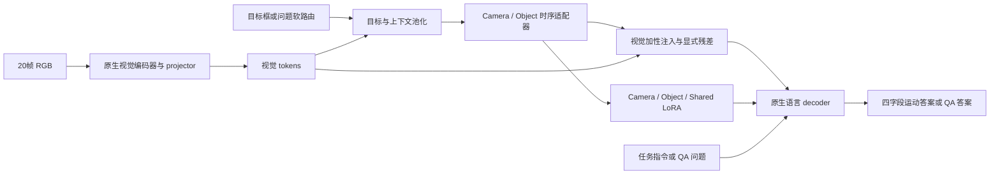

# 核心代码导读

模型主体在 `mosder_final_v1/`。第一次阅读建议按 `core.py` → `bridge.py` → `routing.py` → `objectives.py` → `training.py` 的顺序，最后再看模型加载和训练执行。

## 视频到答案



自建任务用外部提供的目标框，下游 QA 用问题条件软路由。相邻视频帧合并为 10 个时间单元，分别池化目标与上下文；两者池化顺序的细节不同，见[方法说明](../../docs/method_context.md)。

## 主模型文件

| 文件 | 阅读时关注什么 |
| --- | --- |
| [core.py](mosder_final_v1/core.py) | `TemporalMotionSourceAdapter` 如何结合特征与时间差分；两条分支均输出 `[batch, 10, hidden_size]` |
| [bridge.py](mosder_final_v1/bridge.py) | `inject_route_sources` 如何把来源分配到目标/上下文区域；显式残差如何限幅并断开来源梯度 |
| [routing.py](mosder_final_v1/routing.py) | `SourceConditionedTriLoRALinear` 的三条低秩分支，以及 Camera / Object / Full 三种路由 |
| [language.py](mosder_final_v1/language.py) | 四字段标准答案、解析器与 tokenizer span 对齐 |
| [objectives.py](mosder_final_v1/objectives.py) | F 的两项分类损失，以及 G/R 的四字段等权语言损失 |
| [factor_training.py](mosder_final_v1/factor_training.py) | F 阶段六次候选评分的两轮计算与逐候选反传，用来降低显存占用 |
| [training.py](mosder_final_v1/training.py) | 每个阶段允许更新哪些参数 |
| [optimizer.py](mosder_final_v1/optimizer.py) | 参数分组、学习率、weight decay 与检查 |
| [family_backend.py](mosder_final_v1/family_backend.py) | 将 MoSDeR 注册到三种 VLM，连接原生视觉/语言接口 |
| [contract.py](mosder_final_v1/contract.py) | 模型维度、状态定义及固定配置 |

| 阶段 | 更新参数 | 训练目标 |
| --- | --- | --- |
| F | Camera/Object 适配器及 LoRA、来源门控、两个判断偏置 | 从候选答案分数学习两个运动因子 |
| G | Shared LoRA | 四字段答案的等权语言损失 |
| R | 两条显式残差分支 | 与 G 相同的语言损失 |
| 下游 QA | MoSDeR 新增参数，排除两个判断偏置 | QA 答案损失＋来源复习 |

基座 VLM 在这些阶段保持冻结。下游 QA 的软路由器单独训练后冻结。

## 公共组件

| 路径 | 当前作用 |
| --- | --- |
| `family_backends_v1.py` | 三种模型的原生视频接口、模型环境绑定及普通 LoRA 支持 |
| `mosder_fgr_runner_candidate_v3/` | 主训练复用的 `engine.py`、`checkpoint.py`、采样与调度组件 |
| `mosder_fgr_runner_compute65_v1/` | 固定计算预算的协议设置，部分 QA 运行代码仍引用它 |
| `mosder_consumed_field_projection_v2/` | 从 benchmark 记录提取模型输入与监督字段，并提供固定 query |
| `mosder_short_event_qa_pilot_v1/` | 下游复用的模型加载、QA 输入约定、推理和结果持久化 |
| `mosder_target_visible_qa_eval_v1/` | 将四状态映射到随机选项的 QA 约定与指标 |
| `tst_na_o18_core_v1.py` | 原生 backend 使用的适配器类型和工具 |

主 benchmark 训练入口及 checkpoint 选择规则见 [训练与验证入口](../training/README.md)。

## CPU 上查看来源接口

在仓库根目录运行，环境需要 PyTorch 和 NumPy：

```bash
PYTHONPATH=code/core python - <<'PY'
import torch
from mosder_final_v1 import MoSDeRMotionSourceCore

model = MoSDeRMotionSourceCore(hidden_size=64, rank=8)
target = torch.randn(1, 10, 64)
context = torch.randn(1, 10, 64)
sources = model(target, context)
print(sources.camera_source.shape, sources.object_source.shape)
PY
```

这个例子只演示张量接口，使用随机初始化的小模型，不能用于预测或报告指标。
