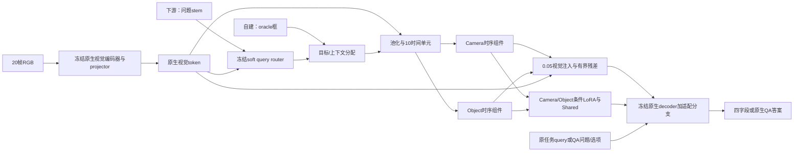

# MoSDeR 方法说明

本文介绍 MoSDeR 架构、benchmark 训练流程和下游 QA 方法。实验结果见 [results](../results/)，数据统计见 [data/paper_tables](../data/paper_tables/) 与 [benchmark 统计](../data/benchmark/statistics.json)，代码入口见[核心导读](../code/core/README.md)。

## 1. 方法范围和问题设定

MoSDeR以冻结的原生VLM为底座，从目标区域和非目标上下文中分别学习Object和Camera来源序列，通过视觉token加性注入和来源条件LoRA影响原生语言decoder。基座视觉编码器、projector、词嵌入、decoder原参数保持冻结；新增参数按阶段更新。

存在两个明确的信息设定：

- 自建运动来源任务：输入20帧真实RGB、指定目标的oracle框轨迹、时间戳和固定query；输出Camera/Object状态及其四状态组合。oracle表示由外部提供，不表示框无误差。运动标签来自物理轨迹预处理，推理不输入GT轨迹或标签。
- 下游视频QA：输入原视频和原QA问题/选项；使用冻结的query-conditioned soft router确定内部目标权重，不需要外部oracle框。来源复习样本在训练时使用其已知目标框。最终QA由原生decoder生成，不由四状态查表产生。

两种任务的目标信息分别来自 oracle 框与问题条件软路由。

## 2. 符号和张量

| 符号 | 含义 | 形状/范围 |
|---|---|---|
| V | 按时间顺序的真实RGB帧 | 20张，原始分辨率依来源而异 |
| q | 问题/固定任务指令 | 文本 |
| B | 自建任务的目标框轨迹 | 20×4，xyxy |
| X | 原生post-projector视觉token | T×H×W×D |
| M / 1−M | 目标 / 非目标上下文分配 | 自建为布尔网格；下游为[0,1]软权重 |
| H_o, H_c | 目标/上下文池化序列 | 10×D |
| S_o, S_c | Object/Camera来源序列 | batch×10×D |
| y_c,y_o | GT运动二值标签 | {0,1} |
| q_c,q_o | Stage-F来源分类logit | 每样本两个标量 |
| Δ_o,Δ_c | 可学习显式残差 | batch×10×D，逐元素绝对值≤0.10 |
| a | decoder生成的答案 | 自建四字段；下游原QA答案 |

来源序列是潜在特征，不是三维位置、姿态或物理轨迹。相机分支读取非目标区域，并不意味着非目标区域一定静止；原生视觉token也已含全局上下文，不能据此声称两分支信息统计独立。

## 3. 原生视觉接口与oracle框池化

实现：`family_backends_v1.py` 的 `project_frame_box_masks`、`adjacent_unit_masks`、`_build_visual_bundle`。

1. 通过各模型原生视觉编码器与projector获得网格token，保持原生语言接口。
2. 对20帧框按图像尺寸映射到token网格：左上floor、右下ceil并clip，覆盖区域形成布尔mask。
3. 将相邻两帧的mask取并集，得到10个时间单元的目标mask；非目标mask是补集。有效性要求目标和上下文可池化。
4. Molmo/NVILA原生有20帧token，先相邻两帧token取均值，再用并集mask池化；Qwen原生视觉时间轴已有10个单元，直接与10个mask对应。
5. 每个单元分别对目标和上下文token求均值，得到H_o、H_c。

自建任务先配对平均 token，再按并集 mask 池化；下游软路由先逐帧软池化，再相邻配对平均。

oracle框本身可能由3个锚点确定：模型帧0、9、19的中心、宽高沿绑定时间插值，宽高在log空间插值，生成20帧框；不同来源也可提供直接20框。真实RGB帧不插值、不合成。具体路径由每行 `model_input.oracle_box_track` 记录。

## 4. Camera/Object时序来源组件

实现：`mosder_final_v1/core.py:TemporalMotionSourceAdapter`。两条独立参数分支：Camera只接H_c，Object只接H_o。来源瓶颈rank=32。

单分支计算，省略batch维：

\[
U_t=\operatorname{LN}_{in}(H_t),\quad d_1=0,\quad d_t=U_t-U_{t-1},
\]
\[
Z_t=W_{up}\operatorname{GELU}(W_{down}[U_t;d_t]+b_{down})+b_{up}+E_t,
\]
\[
S=\operatorname{LN}_{out}\{Z+\operatorname{GELU}(\operatorname{Mix}_{time}(Z))\}.
\]

W_down将2D压缩到32；W_up从32恢复D；E为10×D可学习时间嵌入，初始化正态std=0.02；Mix_time是沿10个时间单元作用的Linear(10,10)，含bias。输入/输出LayerNorm含可学习参数。该差分是特征差分，不是光流，也不是世界速度。

## 5. 两种来源注入路径

### 5.1 post-projector视觉加性注入

实现：`bridge.py:inject_route_sources`。

令E_t(S)表示把10单元来源序列扩展到对应原生时间轴，则FULL_LANGUAGE下：

\[
X'=X+0.05[(1-M)\odot E_t(S_c)+M\odot E_t(S_o)]
 +(1-M)\odot E_t(\Delta_c)+M\odot E_t(\Delta_o).
\]

Camera来源只分配到上下文token，Object只分配到目标token。空间维广播同一时间单元的D维向量。CAMERA_FACTOR只启用0.05 Camera注入；OBJECT_FACTOR只启用0.05 Object注入；显式Δ仅FULL_LANGUAGE启用。

### 5.2 来源条件TriLoRA

实现：`routing.py:SourceConditionedTriLoRALinear`。选定decoder层的attention Linear上并联Camera、Object、Shared三组低秩分支。每组rank=8、alpha=16、dropout=0，缩放alpha/rank=2。

\[
g_c=\tanh(W_{gc}\operatorname{mean}_t S_c),\quad
\delta_c(h)=2 B_c[(A_ch)\odot g_c],
\]

Object对称；Shared没有来源门控：δ_s(h)=2B_sA_sh。FULL_LANGUAGE输出W_0h+δ_c+δ_o+δ_s；Camera factor route仅W_0h+δ_c，Object route仅W_0h+δ_o。门控均值和投影以FP32计算；来源序列在这一路没有detach，QA梯度可沿门控回流来源组件。

Shared是低秩适配参数，不是单独decoder。当前四字段是训练目标，不是多加的四个数值预测头，也没有把GT四状态作为语言输入。

### 5.3 显式残差模块

实现：`bridge.py:BoundedTemporalSourceResidual`。两支各rank16，非仿射LN，down/up无bias，gate为D→1含bias。up全零初始化，gate权重/bias全零初始化。

\[
U=\operatorname{LN}(\operatorname{stopgrad}(S)),\quad
\Delta(S)=0.10\,\sigma(W_gU+b_g)\odot\tanh(W_u\operatorname{GELU}(W_dU)).
\]

gate是每时间单元一个标量，广播到D；输出逐元素有界，不代表相对token范数有相同比例上界。显式残差路径的来源输入始终detach；在下游联合更新时也没有取消。因此“QA通过所有路径回传来源组件”不准确：直接0.05注入和TriLoRA门控可回传，Δ的输入不回传。

## 6. F/G/R阶段及损失

### 6.1 F：来源分离的候选得分监督

候选是四个规范英文四字段答案。每个候选得分来自原生decoder teacher forcing下答案token的平均log probability，不是另建分类头。

Camera route对neither和camera_only评分；Object route对四状态评分。记对应分数为s_c(n),s_c(c),s_o(n),s_o(c),s_o(o),s_o(b)：

\[
m_c=s_c(c)-s_c(n),\quad
m_o=\tfrac12[(s_o(o)-s_o(n))+(s_o(b)-s_o(c))],
\]
\[
q_c=m_c+b_c,\quad q_o=m_o+b_o,
\]
\[
L_F=\operatorname{softplus}(-(2y_c-1)q_c)+\operatorname{softplus}(-(2y_o-1)q_o).
\]

b_c/b_o是训练可学习标量，零初始化；零阈值决策时q>0为moving，否则static。Object margin平均两个相机条件下的分差；这一构造是对比目标，不能自动写成因果消混淆证明。

训练实现使用exact two-pass：先无梯度获取六个候选分数与损失系数，再逐候选重算并累积链式梯度，同时更新两标量偏置。不是把无梯度分数直接当可微目标；目的是降低同时保存多路计算图的显存需求。

### 6.2 G：Shared语言适配

在F端点基础上冻结来源组件、Camera/Object LoRA和决策偏置，只更新Shared LoRA。以FULL_LANGUAGE路线teacher forcing生成四字段。

四字段各自token平均NLL，再等权求和：
\[
L_G=\frac14\sum_{k\in\{C,O,S,D\}}\left[-\frac1{|I_k|}\sum_{i\in I_k}\log p(a_i\mid V,q,B,a_{<i})\right].
\]

I_k由真实tokenizer与答案对齐确定，四段完整覆盖答案token，不能随意按字符数代替token分段。Description为每状态固定一句描述，不是逐视频人工自由描述。

### 6.3 R：显式残差适配

从G端点继续，冻结其他全部参数，仅更新Camera/Object显式残差的8个参数张量。L_R与L_G数值定义相同。R端点相对G仅改变该残差模块；当前G/R性能差异属于“增加残差训练阶段”比较，不能单独排除额外训练预算影响。

### 6.4 模块—阶段—梯度表

| 模块 | F | G | R | 下游2048QA |
|---|---|---|---|---|
| 原生视觉、projector、decoder、词嵌入 | 冻结 | 冻结 | 冻结 | 冻结 |
| Camera/Object时序来源组件 | 更新 | 冻结 | 冻结 | 更新 |
| Camera/Object LoRA及来源gate | 更新 | 冻结 | 冻结 | 更新 |
| Shared LoRA | 冻结 | 更新 | 冻结 | 更新 |
| b_c,b_o | 更新 | 冻结 | 冻结 | 冻结，QA不靠其读出 |
| Camera/Object显式残差 | 冻结零初始化 | 冻结 | 更新 | 更新 |
| query软路由器 | 不使用，oracle框 | 不使用，oracle框 | 不使用，oracle框 | 单独训练后冻结 |

从R checkpoint实际张量补计：时序来源组件909,596；Camera/Object LoRA与gate共1,310,720；decision标量2；Shared524,288；显式残差270,338。F/G/R分别更新2,220,318 / 524,288 / 270,338参数。Molmo方法总参数3,014,944；下游更新3,014,942，恰好排除两个decision标量。

## 7. Full internal＋QA的软目标路由

实现：当前依赖的 `soft_query_router.py`、`soft_query_backend.py`。

问题stem排除选项和teacher-forced答案，取冻结原生输入词嵌入的均值e_q（词序在这一步丢失）。native视觉token与e_q分别非仿射LN，再做rank64投影：
\[
k_{tij}=W_v\operatorname{LN}(X_{tij}),\quad k_q=W_q\operatorname{LN}(e_q),
\]
\[
\ell_{tij}=k_{tij}^{\mathsf T}k_q/\sqrt{64}+w_b^{\mathsf T}k_{tij}+b,
\quad M_{tij}=\sigma(\ell_{tij}).
\]

这是每token独立membership sigmoid，不是空间softmax。上下文权重为1−M。逐帧池化分母clamp_min(1)，避免极小噪声总质量被归一化放大。20帧池化后相邻平均为10单元。不存在每帧必须有目标的硬约束，但权重不是经过校准的目标缺失概率，也不是分割GT。

当前冻结router为D4096/rank64，有524,353参数。单独用37个训练视频的74个稀疏框锚点拟合；8视频14锚点用于报告，不用于选checkpoint。200次AdamW更新，batch8视频，lr1e-3、weight_decay0.01、clip1、seed20260907，使用固定最终端点。监督是框与网格的面积占比，按已知帧计算正负项平衡BCE；未标注帧无loss。没有用QA答案训练该router。以上属于当前方法所依赖组件的训练信息，必须计入额外监督披露。

来源复习时临时用oracle框的网格面积占比替换router输出，使用同一软池化接口；它与MoSDeR主训练布尔框并集方式有实现差别。QA时恢复预测软路由，外部只提供原始视频/问题。

## 8. 下游QA与来源复习联合目标

每次参数更新累积8条QA和2条来源样本。QA答案NLL为整段答案token平均；来源复习也为整段四字段答案token平均，不是G/R四段等权。

\[
L_{down}=\frac18\sum_{i=1}^{8}\ell_{QA,i}
+0.25\,\frac12\sum_{j=1}^{2}\ell_{source,j}.
\]

实际每QA调用(loss/8).backward()；每4条QA加入1条来源，调用(0.125*source_loss).backward()，一更新来源共2条。2048条QA只过一遍，512个不同来源样本各一次，共256次更新。没有三轮训练、定期early stopping或dev选最佳权重；固定256终点再报告dev650、val914。

QA判断题teacher-forced答案为“是/否”，选择题为原选项字母。QA问题与选项沿用输入；生成max_new_tokens32、do_sample=False，按冻结的YN/MC parser计分。整个原生VLM和router保持冻结，MoSDeR除两个decision标量外全部新增参数共同更新。此目标没有额外KL或通用语料能力保持项；来源复习是运动来源任务复习，不能称作通用语言蒸馏。

## 9. 自建任务的输出和程序读出

主训练query：

> Analyze the motion source in this 20-frame video for the queried target specified by the oracle box track. Distinguish camera motion from target-object motion. Respond using exactly four lines: Camera, Object, State, Description.

四状态规范答案如下：

```text
Camera: static
Object: static
State: neither
Description: the camera and queried target remain stationary.
```
```text
Camera: moving
Object: static
State: camera_only
Description: the camera moves while the queried target remains stationary.
```
```text
Camera: static
Object: moving
State: object_only
Description: the queried target moves while the camera remains stationary.
```
```text
Camera: moving
Object: moving
State: both
Description: both the camera and queried target move.
```

现有84.08%来自FULL_LANGUAGE自由生成后解析四状态；不是Stage-F两个margin直接组合的准确率。当前自建QA评测继续用同一四字段query生成，再由确定性代码将预测state映射到每样本指定问题：camera/object读取相应bit并处理“moving/stationary”问法反转；joint按该样本选项顺序返回字母。该转换只读预测state与问题spec，不读GT。GT仅用于独立计分。

因此映射QA评测衡量“来源状态预测＋程序读出”，不等于模型对该QA问法的直接指令遵循能力。下游OmniVCHall采用原生QA生成，是另一条推理协议。

## 10. 两种模型接口的事实边界

- 自建MoSDeR通过内部oracle网格获取目标；普通LoRA通过query附加20帧normalized xyxy坐标获得目标。同一目标信息、不同编码接口，不应宣称输入张量完全相同。
- 来源注入是影响decoder的连续特征，不是把camera/object GT写入提示词。
- 基座冻结使原参数保持不变，但新增分支会改变输出；没有全面能力保持实验，不能宣称原VLM能力完全不损失。
- 模块所有权和梯度隔离是实现事实；“Camera语义纯净”“Object完全剥离相机影响”“因果解耦”需要额外证据，不能仅凭结构命名成立。

## 11. 方法流程


